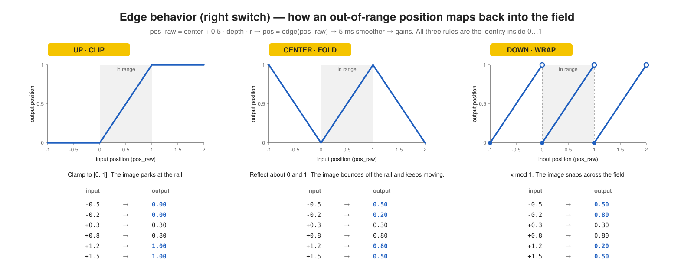

# legio-drifter

Alternative firmware for the Noise Engineering Legio Eurorack module. Drifter turns Legio into a random Bézier auto-panner, crossfader, or CV panner.

## What drifter does

Drifter moves a value along a random Bézier curve over time. The curve wanders between two points. You set the center point, the wander depth, and the wander speed. Drifter uses the wandering value in one of three modes, set by the left switch.

## Controls

Set the left switch to choose the mode:

| Switch position | Mode | Function |
|---|---|---|
| Up | AUDIO PAN | Pans the audio input between the left and right outputs. |
| Center | XFADE | Crossfades between two audio inputs. The output is mono, on the left jack. |
| Down | CV PAN | Sends the CV at the V/OCT input jack to a random position between the left and right outputs. |

Other controls:

| Control | Function |
|---|---|
| Top knob + CV | Sets the center point of the wander (left → right, or A → B). |
| Bottom knob + CV | Sets how far the wander moves from the center point. |
| Right switch | Sets what happens when the wander goes past the edge: CLIP, FOLD, or WRAP. See the diagram below. |
| Encoder, rotate | Sets the wander rate. Free-running range: 5 minutes to 20 Hz. Clocked range: ÷8 to ×8. |
| Encoder, tap | Switches to curve-shape edit mode. The LEDs turn yellow. |
| Encoder, long-press, CV PAN mode only | Turns on an internal +5 V source. The outputs become a complementary pair of slow random voltages. You do not need an external CV source. |
| Gate input | Clock input. Each valid edge sets a new random target. |

The diagram below shows how the right switch maps an out-of-range value back into range:



## Build, test, and flash

Build the firmware:
```sh
make -C lib/libDaisy
make
```

Run the host-side DSP tests. These tests do not need Legio hardware.
```sh
make -C test
```

Flash the firmware to your module:
```sh
make program-dfu
```

See [`AGENTS.md`](AGENTS.md) for the file layout and hardware notes.

## Calibrate the V/OCT input for your module

Only CV PAN mode reads the V/OCT jack. In this mode, drifter reads the jack as a plain DC voltage, not as a pitch signal.

Each Patch SM module has a slightly different ADC offset and gain. The constants `kCvZero` and `kCvScale`, in `src/cv_in.h`, were measured on the author's module. Calibrate your own module if a patched 0 V reads as non-zero, or a patched +5 V reads as not-quite-5-V.

1. Flash the firmware, then open serial telemetry: `screen /dev/cu.usbmodem* 115200`. Each line shows `cv_norm=<f>` (the raw ADC reading, 0 to 1) and `cv=<f>V` (the reading converted with the current constants).
2. Patch a known 0 V source into the V/OCT jack. Note the `cv_norm` value. Use this value for `kCvZero`.
3. Patch a known +1 V source into the V/OCT jack. Note the `cv_norm` value. Call this value `raw_1v`. Calculate `kCvScale = 1.0 / (raw_1v - kCvZero)`.
4. Copy `src/calibration_local.h.example` to `src/calibration_local.h`. Enter your two values. Rebuild and reflash. Git ignores this file, so your values survive `git pull`. You can also edit the default values in `src/cv_in.h` directly.

Set `kCvScale` to 0 to disable the CV path. Every reading then becomes 0 V. Drifter applies a ±0.05 V deadband around 0 V after conversion, so a patched 0 V reads as exactly 0 V.

## License

MIT. See [`LICENSE`](LICENSE). The libDaisy submodule is MIT-licensed by Electrosmith.
